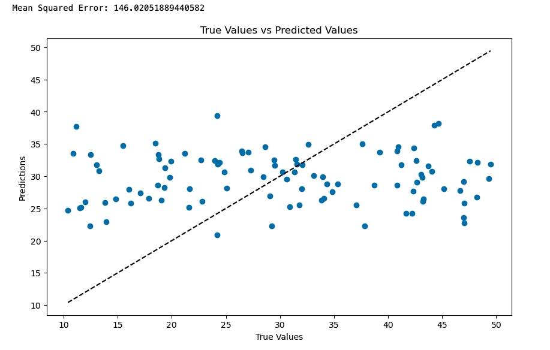

# ✅ Solution: Exercise – Supervised vs Unsupervised

## Supervised Learning Exercise: Predicting Building Energy Efficiency

In this exercise, you trained a **RandomForestRegressor** model to predict the energy efficiency of buildings based on features such as wall area, roof area, overall height, and glazing area.

### 🧪 Expected Results

- **Data Visualizations**  
  Scatter plots will show the relationship between each feature and the target variable (Energy Efficiency).  
  While using synthetic data, clear trends might not always appear, but learners should start to see how feature changes may relate to outcomes.

- **Model Performance**  
  After training and prediction, the **Mean Squared Error (MSE)** is calculated.  
  A lower MSE suggests better model performance, though results may vary due to random data generation.

- **Prediction vs. True Value Plot**  
  The scatter plot comparing true values and predictions should ideally form a diagonal line (`y = x`).  
  Points far from this line indicate **errors** in predictions.

> 📌 **Reminder:**  
> Be sure to delete the notebook instance after you're done to avoid unnecessary usage.

  
**True Values vs Predicted Values**

---

## Unsupervised Learning Exercise: Vehicle Clustering

In this exercise, you used **KMeans clustering** to group vehicles based on features like **weight, engine size, and horsepower**.

### 🧪 Expected Results

- **Cluster Visualization**  
  A scatter plot will show vehicles grouped by weight and horsepower.  
  Each cluster will appear in a **different color**, helping visualize how the algorithm categorized the data.

- **Interpreting Clusters**  
  Since unsupervised learning lacks true labels, interpretation is based on observed **similarities**.  
  For example, heavier vehicles with higher horsepower may cluster together naturally.

> 💡 With synthetic data, the clarity of clusters may vary, but key groupings should still be noticeable.

> 📌 **Reminder:**  
> Be sure to delete the notebook instance after you're done to avoid unnecessary usage.

  
As discussed above, this scatter plot visually depicts how vehicles are grouped based on **weight** and **horsepower**.  
There are **three distinct groups**.

---

## 🎯 Key Takeaway

Exact values and cluster patterns may differ depending on random data generation and model variability.  
However, the **core learning objective** is to understand the process of applying ML techniques and interpreting the results—not just numerical accuracy.

